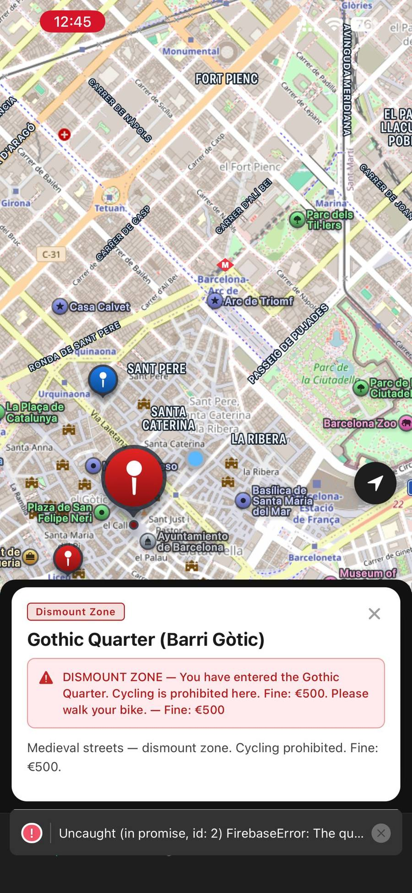
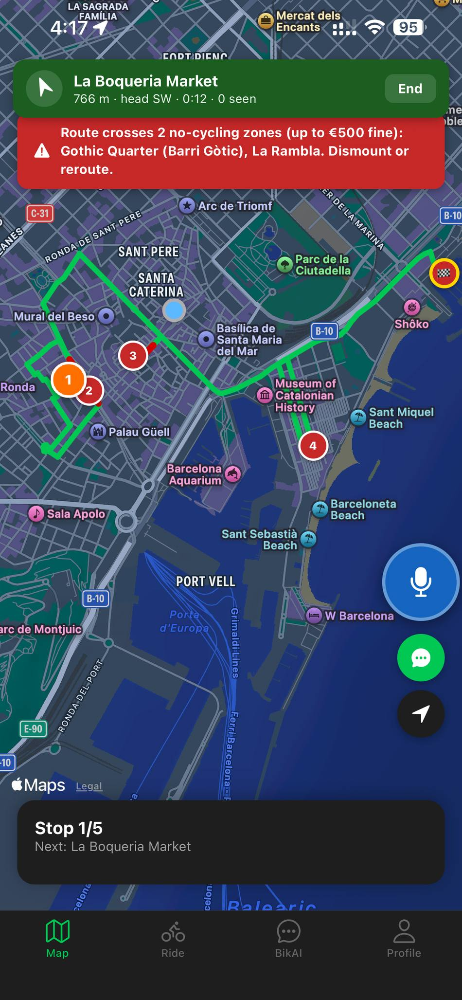
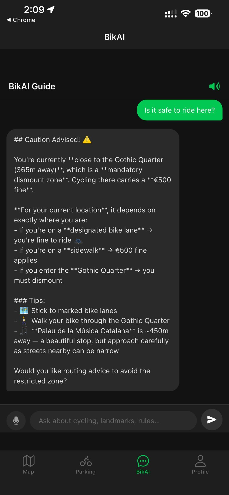
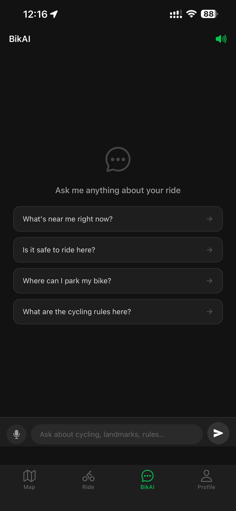
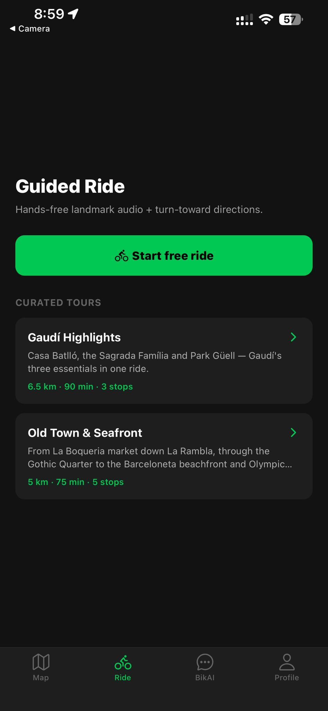
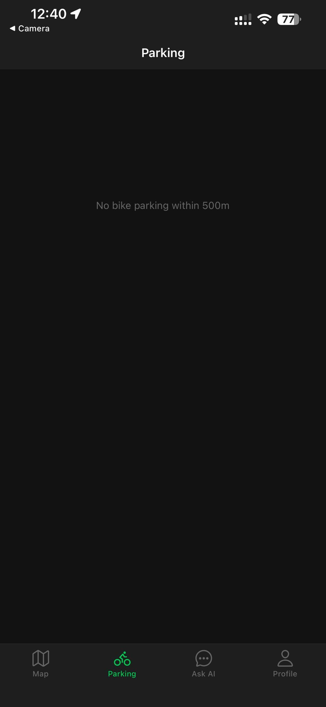

# Barcelona CycleGuide


-D97757)


A mobile bike-tour guide for Barcelona: a React Native / Expo app that narrates points of interest by voice as a cyclist rides past them, warns about no-cycling zones before a fine happens, and answers spoken questions in six languages through a Claude-powered assistant — all without the cyclist ever having to stop, look down, or search.

Built solo, in pair-programming with an AI development assistant (Claude Code), end to end: architecture, native mobile code, backend, and documentation.

## Le problème

A human bike-tour guide gives context, safety warnings, and answers to questions — but only to one group, in one language, and only during the tour itself. Once the guide leaves, that value disappears.

Barcelona CycleGuide's goal is to preserve that experience after the human guide is gone, without turning the cyclist into someone constantly checking a screen. The guiding constraint behind every feature: **"le cycliste ne doit jamais avoir à s'arrêter, baisser les yeux, ni chercher"** — the cyclist should never have to stop, look down, or search.

## Fonctionnalités

- **Géofencing de proximité** — des zones invisibles d'environ 40 mètres déclenchent automatiquement une fiche de lieu et sa narration vocale à l'approche, sans action de l'utilisateur.
- **Alertes réglementaires préventives** — avertissement avant d'entrer dans une zone interdite au vélo à Barcelone (amendes réelles pouvant atteindre 500 €), pas après.
- **Assistant vocal multilingue (BikAI)** — questions posées à voix haute, réponses contextualisées à la position du cycliste, dans six langues.
- **Navigation turn-by-turn vocale** — instructions de direction avec réajustement automatique de l'itinéraire en cas de déviation.
- **Recherche de stationnement en temps réel** — données ouvertes des systèmes de vélos en libre-service de la ville (Bicing, Bicibox).
- **Gamification** — points et progression pour encourager la découverte de nouveaux lieux.
- **Parcours guidés** — tours prédéfinis avec trajectoire tracée sur la carte.

## Stack technique

| Couche | Technologie |
|---|---|
| Frontend mobile | React Native + Expo SDK 54 — un seul code source pour iOS et Android |
| Backend | Firebase / Google Cloud — 5 collections Firestore, schéma et règles de sécurité dédiées |
| Géofencing | Moteur de proximité maison basé sur la formule de Haversine (`expo-app/src/utils/haversine.ts`) |
| IA conversationnelle | Intégration Claude (Anthropic), contextuelle et multilingue (`@anthropic-ai/sdk`) |
| Navigation | OSRM pour le calcul et le guidage d'itinéraire |
| Voix | `expo-speech` / `expo-speech-recognition` pour la synthèse et la reconnaissance vocale |
| Internationalisation | react-i18next, 6 locales |
| Distribution | EAS Build (APK Android) |
| Automatisation | GitHub Actions — générateur quotidien qui enrichit la base de lieux |

## Décisions techniques

**1. Abandon du no-code (FlutterFlow).**
Le prototype initial a été construit sur FlutterFlow. Après 1,5 phase de développement, les limitations de la plateforme ont bloqué l'accès GPS natif et les librairies d'IA — c'est-à-dire précisément le cœur du produit. Plutôt que de contourner ces contraintes avec des hacks, le projet a été entièrement reconstruit en React Native / Expo, qui offre un tier gratuit sans plafond structurel.

**2. Géofencing maison plutôt qu'un service tiers.**
Le service Radar.io, envisagé pour le géofencing, rejetait les adresses personnelles nécessaires au cas d'usage. Plutôt que de supprimer une fonctionnalité centrale du produit, un moteur de détection de proximité a été implémenté directement avec la formule de Haversine. Trois heures de travail, et la dépendance externe disparaît.

**3. Documentation et handoff pensés pour un commanditaire non technique.**
Le projet a été livré avec une documentation complète (`docs/BarcelonaCycleGuide_Documentation.docx`, générée par `docs/generate_docs.py`) et un document de handoff listant explicitement les limites connues, pour qu'un commanditaire sans bagage technique puisse comprendre l'état réel du produit.

## Développement assisté par IA

Ce projet a été développé en binôme avec un assistant de développement IA (Claude Code), de la phase d'architecture jusqu'à la documentation finale. L'assistant n'a pas remplacé les décisions techniques (choix d'abandonner FlutterFlow, choix du moteur de géofencing maison) : il a accéléré leur exécution. Le tout premier code de l'application a été écrit et livré entre le 1er et le 6 juin 2026, sur 20 phases documentées, en 42 heures.

Les traces de ce processus (sessions de travail, notes de handoff) sont conservées telles quelles dans [`docs/dev-log/`](docs/dev-log/) plutôt que supprimées : elles documentent comment le produit a été construit, pas seulement ce qu'il fait.

## Captures d'écran

| Alerte réglementaire | Itinéraire sécurisé |
|---|---|
|  |  |

| Assistant BikAI — sécurité | Assistant BikAI — accueil |
|---|---|
|  |  |

| Parcours guidés | Stationnement |
|---|---|
|  |  |

## État actuel / limites

**Ce projet est un prototype fonctionnel en cours de test, pas un produit en production.**

Ce qui a été testé :
- Sur appareils réels (iPhone et Android) via serveur de développement Expo.
- Pipeline vocal (capture → reconnaissance → synthèse) débogué à l'aide d'une couche de diagnostic à l'écran.
- Géofencing testé à la fois à l'intérieur et à l'extérieur de Barcelone.
- Les six langues vérifiées au niveau de l'interface et de l'audio.
- Notifications testées en premier plan et en arrière-plan.

Limites assumées et connues, documentées explicitement dans le handoff remis au commanditaire :
- Pas de déploiement en production ni de publication sur les stores à ce stade.
- Couverture de test manuelle, pas de suite de tests automatisés end-to-end.
- Dépendance à des données ouvertes tierces (Bicing/Bicibox) dont la fraîcheur n'est pas garantie par le projet.

## Structure du dépôt

```
expo-app/       Application React Native / Expo (code source principal)
firebase/       Règles Firestore et scripts de seed
api/            Endpoints serveur
scripts/        Génération automatisée de la base de lieux
docs/           Documentation technique (setup, parité iOS/Android, doc générée)
docs/dev-log/   Traces de développement (sessions, handoff, plan d'étude — non supprimées, archivées)
```

## Voir aussi

- [Page portfolio complète du projet](https://kamgangharold-ui.github.io/projets/barcelona-cycleguide.html) — présentation détaillée avec contexte commanditaire et captures d'écran additionnelles.
- [Mémoire de stratégie Pink Ducks](https://kamgangharold-ui.github.io/projets/pink-ducks.html) — le travail de fond dont ce projet est issu ; le fondateur de Pink Ducks (loueur de vélos électriques) est le commanditaire de cette application.

---

Projet réalisé par [Harold Kamgang](https://github.com/kamgangharold-ui).
